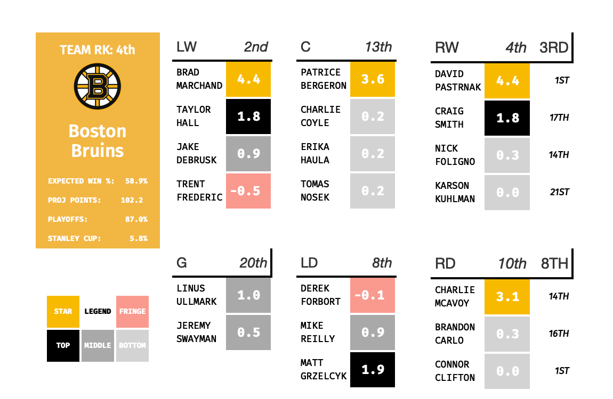

# grid-rmd

This is a quick example of how to create "team cards" with R, `gt` and `RMarkdown`, with heavy lifting being done by the integrated bootstrap grid. While the end result is HTML and could be returned by an API or as a website, a screenshot can also returned via `webshot`.

Original Concept from [Dom at The Athletic](https://twitter.com/domluszczyszyn/status/1447937525591461889?s=20)

